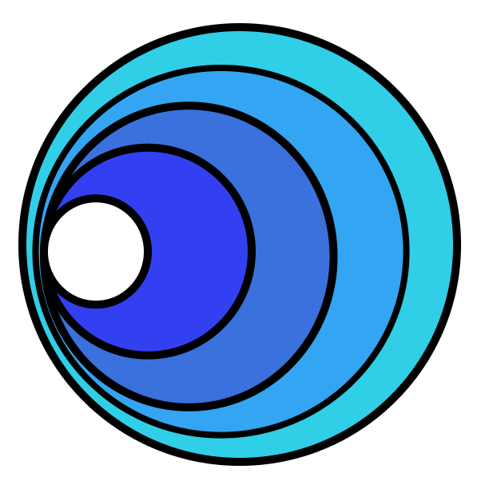

# ⎈ Cómo la IA puede ayudarte con tus clústers de Kubernetes ⎈

En este repo quiero compartir contigo tres formas en las que la inteligencia artificial puede ayudarte con tus clústers de Kubernetes. Para que puedas probar todo, y no tengas que instalar nada, puedes ejecutar este repo como un Dev Containers o en GitHub Codespaces, [¡del cual tienes 15GB/mes y 120 horas gratuitas al mes en tu cuenta personal!](https://docs.github.com/en/billing/managing-billing-for-github-codespaces/about-billing-for-github-codespaces#monthly-included-storage-and-core-hours-for-personal-accounts)

# Cómo la IA puede ...


<details>
<summary> <h2>🎁 ... ayudarte a aprender 👩🏼‍🏫 Kubernetes</h2></summary>

## GitHub Copilot 


Con GitHub Copilot puedes aprender Kubernetes de forma más rápida y sencilla. Puedes utilizar el chat o simplemente escribir código y GitHub Copilot te ayudará a completarlo.

> Puedes probar GitHub Copilot de forma gratuita en [GitHub Copilot Individual Free Trial](https://github.com/github-copilot/signup).

Una vez que tengas la cuenta, puedes usar cualquiera de estos IDEs para probar GitHub Copilot:

En Visual Studio Code solo tienes que instalar la extensión de GitHub Copilot: [GitHub Copilot](https://marketplace.visualstudio.com/items?itemName=GitHub.copilot) y ver este vídeo 😊


</details>

<details>
<summary> <h2>🎁 ... trabajar 👷🏼‍♀️ en tus clústers de Kubernetes</h2></summary>

## kubectl ai

kubectl ai es un plugin de kubectl que te ayuda a trabajar con tus clústers de Kubernetes. Puedes instalarlo con:

```bash
brew tap sozercan/kubectl-ai https://github.com/sozercan/kubectl-ai
brew install kubectl-ai
```

Lo único que te queda por hacer es crear un modelo de GPT4 en Open AI o Azure Open AI. 

```bash
# Variables
RESOURCE_GROUP="ai-loves-k8s"
LOCATION="canadaeast"
AZ_OPEN_AI="aifork8s"

# Login to Azure
az login

# Create Azure Open AI resource
az group create --name $RESOURCE_GROUP --location $LOCATION

# Create Azure Open AI resource
az cognitiveservices account create \
--kind OpenAI\
 --name $AZ_OPEN_AI \
 --custom-domain $AZ_OPEN_AI \
 --sku S0 \
 --resource-group $RESOURCE_GROUP \
 --location $LOCATION

# Create Chat GPT-4 deployment
az cognitiveservices account deployment create \
--name $AZ_OPEN_AI \
--resource-group  $RESOURCE_GROUP \
--deployment-name gpt-4 \
--model-name gpt-4 \
--model-version "0613"  \
--model-format OpenAI \
--sku-capacity "1" \
--sku-name "Standard"
```

Y exportar a las siguientes variables de entorno la información de tu modelo de GPT4:

```bash


</details>


<details>
<summary> <h2>🎁 ... analizar 🧐 tus clústers de Kubernetes</h2></summary>

## k8sgpt



k8sgpt es un modelo de lenguaje de inteligencia artificial que te ayuda a analizar tus clústers de Kubernetes. Puedes instalarlo con:

```bash
brew tap k8sgpt-ai/k8sgpt
brew install k8sgpt
```

Pero si abres este repo en un Dev Container o en GitHub Codespaces ya lo tienes instalado 😉


### Azure Open AI:


</details>